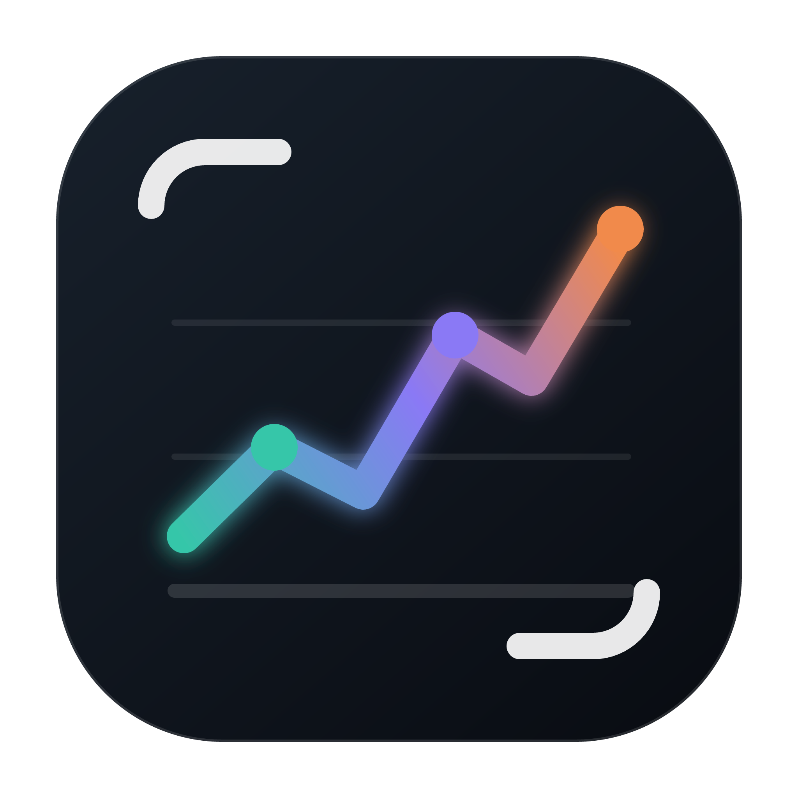
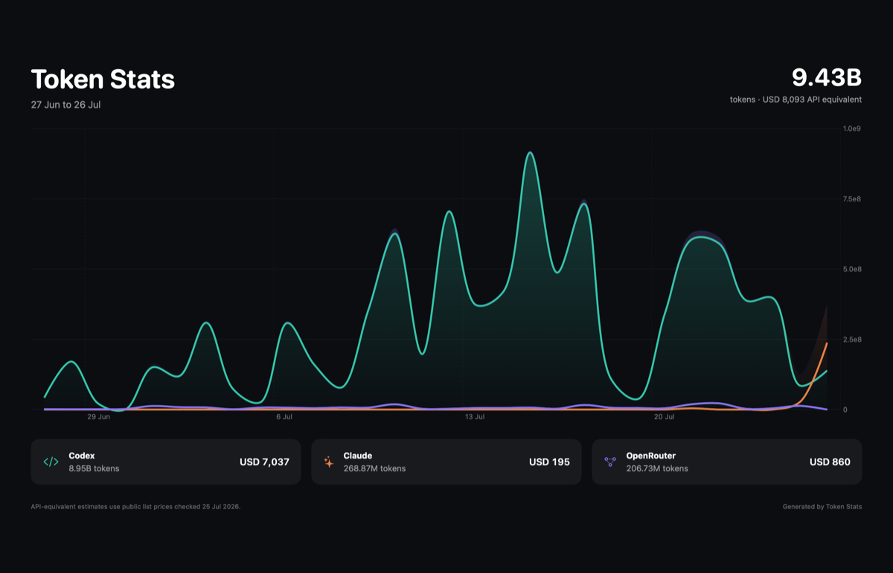
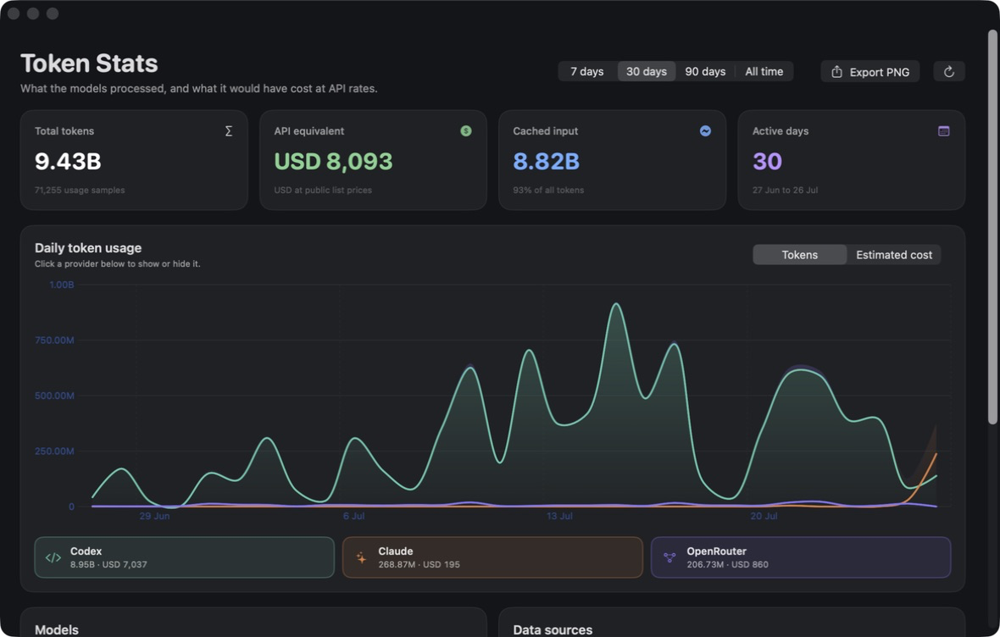

#  token-stats

See how many AI tokens you've been burning and roughly what that'd cost

macOS

<!-- media: hero

media: hero -->

## What it is

This is a little dashboard that reads my Codex and Claude Code session history and charts daily token usage. It also guesses what that would have cost at normal API prices, which is kinda interesting to see.

It can pull exact OpenRouter usage too, and export a PNG of the graph if you want to share it.



## Get it

Paste this into your AI coding agent (Claude Code, Codex, Cursor...):

> Clone https://github.com/mikecann/token-stats and make it my own. It's one of Mike
> Cann's personal tools, so read the README first, change anything specific to his
> setup to suit mine, then help me get it running.

### Or set it up by hand

You'll need macOS 14 or later, Swift 5.10 or later, and Python 3 for the launcher.
Install Xcode or its Command Line Tools with `xcode-select --install`, then check
`swift --version` and `python3 --version`.

```bash
git clone https://github.com/mikecann/token-stats.git
cd token-stats
bash install.sh
token-stats
```

The installer builds and signs `~/Applications/Token Stats.app` locally and links
this clone's launcher into `~/.local/bin`. If that directory isn't on PATH, add
`export PATH="$HOME/.local/bin:$PATH"` to `~/.zshrc` and open a new terminal.
You can choose another launcher directory with `bash install.sh /path/to/bin`.
Keep the clone around, and rerun the installer if you move it.

No `.env` file is needed. Local Codex and Claude histories are read automatically.
For OpenRouter, connect a management key in the app as described below.

## Using it

Open **Token Stats** from Applications or run `token-stats`. Choose 7, 30, 90 days,
or all time, then switch between tokens and API-equivalent cost. Click a provider
to show or hide it. The dashboard includes totals, cached input, active days, and
model breakdowns. Use the export button for a 1400 x 900 PNG.

```bash
token-stats          # Open the app, building it first if missing
token-stats restart  # Stop, build a debug app, and launch it
token-stats stop     # Stop the running app
token-stats setup    # Rebuild and stage the release app
```



## Data sources

Codex is read from `~/.codex/sessions` and `~/.codex/archived_sessions`.
Claude is read from `~/.claude/projects`. Claude's streamed JSONL entries are
deduplicated by message ID so partial copies are not counted repeatedly.

Ripgrep speeds up Codex history loading when found in the ChatGPT app or a
Homebrew installation. There is a pure Swift fallback, so it isn't required.
The Codex index is cached in `~/Library/Application Support/Token Stats`.

## OpenRouter

Automatic activity requires an OpenRouter management key because normal
inference keys cannot access the account Activity API. Create a dedicated key
at [OpenRouter Management Keys](https://openrouter.ai/settings/management-keys),
then choose **Connect API** in Token Stats. The key is stored in macOS Keychain,
never in the repo or app preferences.

The API supplies the last 30 completed UTC days. To add older history, export
the detailed data from [openrouter.ai/activity](https://openrouter.ai/activity):

1. Choose the time period and grouping.
2. Open the options menu.
3. Choose **Export to CSV**.
4. In Token Stats, open the OpenRouter menu and choose **Add history CSV**.

Token Stats remembers the file using a macOS security-scoped bookmark. API rows
take precedence on overlapping days, so importing a CSV never doubles usage.

## Cost estimates

Codex and Claude values are estimates at public API list prices, including
cached reads and cache writes when the source log exposes them. The bundled
rate card was checked on 25 July 2026. Unknown model names still count toward
token totals, but contribute `$0` until a price is added.

OpenRouter API and export costs use the exact billed `usage` value. BYOK
inference estimates are not added because that spend is paid outside
OpenRouter.

## Development

```bash
swift test
bash restart.sh
```

`restart.sh` stops the running copy, builds and signs the debug app, stages it
in `~/Applications`, and launches it. `setup_mac.sh` builds and stages a release
app without adding the command to PATH. `install.sh` does both.

Set `TOKEN_STATS_APP_DIR` to stage a bundle elsewhere. `build-app.sh` also accepts
`TOKEN_STATS_BUILD_CONFIGURATION=debug` or `release` (the default).
The Swift package has no external dependencies. Tests cover usage parsers,
pricing, aggregation, dashboard snapshots, and OpenRouter request construction;
they don't need account keys or live API calls.

## Troubleshooting

If no history appears, use Codex or Claude Code once and click **Refresh**.
If `token-stats` isn't found, check your PATH or run `~/.local/bin/token-stats`.
If OpenRouter can't connect, check that you used a management key, then reconnect
from the OpenRouter menu.

The app keeps its existing bundle and Keychain identifiers so an existing
installation can still read its preferences, CSV bookmark, and saved key.

## More tools

You can find my other tools at [mikerosoft.app](https://mikerosoft.app).

MIT licensed.
